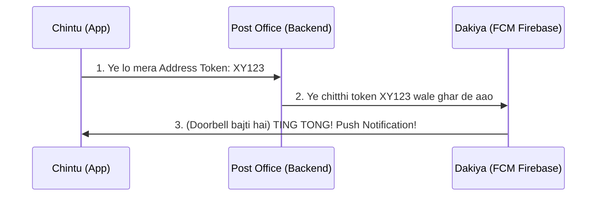

# 🎓 Firebase Cloud Messaging (FCM) - The Ultimate Trainer Guide

Hello Developer! Main aapka Trainer hu, aur aaj hum **FCM (Push Notifications)** ko aise samjhenge jaise ek actual real-world system kaam karta hai. Bina kisi bhari technical words ke. Bas logic aur analogies!

---

## 📬 1. FCM Asal Mein Hota Kya Hai? (The Postman Analogy)

Agar hume FCM ko real life se jodna ho, toh is kahani ko samjho:
* **Firebase (FCM)** = Ek `Dakiya (Postman)` jo chitthiyan deliver karta hai.
* **Tumhare App ka FCM Token** = Tumhare `Ghar ka Address` (jaise: H.No 404, Android Street).
* **Backend Node.js** = `Post Office` jiske paas sab logo ke address register hote hain.
* **Admin Dashboard** = `CM/Sarkar` jo order deti hai ki kisko notice bhejna hai.

### Flow diagram in simple words:

---

## 🤔 2. Sabse Bada Sawal: Token kab de? OTP ke theek baad kyu?

Maan lo maine App install kari. App khulte hi mera ek 'Ghar ka Address' (Token `XY123`) generate ho gaya. 
Agar main ye `XY123` turant **Post Office (Backend)** ko bhej du, toh Post Office ka head poochega: *"Bhai ye ghar ka address toh aa gaya, par is ghar mein rehta kaun hai? Rahul ya Ravi?"*

**Iss problem ka solution:**
Humne code me rule set kiya: *"Jab tak kisan اپنا OTP dalkar verify nahi karta (Aadhaar Check), tab tak Token mat do."*
Isliye jab OTP sahi hota hai:
1. Hume pata chal jata hai ki ye Farmer kaun hai (JWT Token mil gaya).
2. Ab hum jab apna Address (`XY123` FCM Token) bhejte hain, toh Backend turant samajh jata hai: *"Achha! Ye nayi Samsung phone (XY123) waale ghar mein Farmer Ravi rehta hai."* 
3. Backend Ravi ki Profile me `XY123` save kar leta hai!

---

## 📱 3. App ki 3 Halat (States) aur unka asar

Dakiyan (FCM) alag rules lagata hai depend karta hai ki tum ghar ke andar kya kar rahe ho:

### A. FOREGROUND (Tum Gate Par Khade Ho)
* **Status:** Tum App chala rahe ho. Screen ON hai.
* **Dakiya kya karega:** Dakiya shor nahi machayega (koi badsi Popup notification nahi aati). Wo seedha tumhare haath me chitthi pakda dega.
* **Humara Code Kya Karta Hai (`notificationService.js`):** Chitthi ko pakad ke database me save rakhta hai.
* **Result (Redux):** Tumhe upar **Bell Icon pe achanak ek Red Dot `🔴 1`** dikh jayega, exactly bina kisi system popup ke!

### B. BACKGROUND & KILLED (Tum So Rahe Ho ya Tv Dekh Rahe Ho)
* **Status:** App Phone se chali gayi hai ya minimized hai. 
* **Dakiya kya karega:** Use majboori mein **Doorbell (Tring Tring)** bajani padegi taaki tum utho!
* **Humara Code Kya Karta Hai:** Kyuki tumhara "Redux/UI" so raha hai, humara Headless JS Task chup chaap usey Storage me save kar lega.
* **Result (Android OS):** System apni taraf se screen ke top se ek drop-down "Push Notification Box" display karega.

---

## 🏆 4. Interview waala Topic (Badge vs API)

Log puchte hain: *"Jab bell button tap kiya... toh Modal ke andar ki purani notifications API se (Internet se) fetch kyun karte hain? Jo red dot list thi ussi ko kyu display nai kardiya?"*

**Trainer ka Jawaab:** Very simple!
1. **Red Dot (Badge) ke liye:** Wo internet calling nhi karta. Pushes aate hain, wo locally +1 count badha deta hai. Isse phone ki battery bachti hai aur fast performance aati hai. (Event-Driven)
2. **List Open (Modal) ke liye:** Socho tumhara internet kal raat ko band tha. Dakiyan (Firebase) chitthiya leke aaya par laut gaya. Subah uth ke internet on kiya, toh agar tumhare local list pe bharosa kia toh tum wo chitthiyan kabhi dekh hi nahi paoge! Islye Modal open hotay hi, main seedha `/broadcast` Node.js server(Postoffice) se pura records dubara mangwata hun. **Zero Data Loss. 100% Security!**

---
Isse aasan FCM react-native history main nahi samjhaya gaya hoga! Tum bas yahi 3 concepts yaad rakho aur ye architecture tum kisi bhi bari Ecommerce App main confidently bana loge. Happy Coding! 🚀
